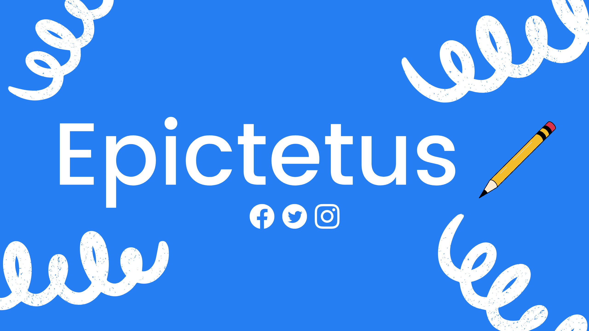

# Epictetus

Epictetus Next.js is a web application built with Next.js, TypeScript, and Tailwind CSS. It serves as a platform for [describe what the project aims to achieve or its purpose].

## Features

- [List key features and functionalities of the application]
- [E.g., User authentication and authorization]
- [E.g., Dashboard for managing user data]
- [E.g., Integration with external APIs]

## Installation

To get started with Epictetus Next.js, follow these steps:

1. **Clone the repository:**

   ```bash
   git clone https://github.com/classicvalues/epictetus-nextjs.git
   cd epictetus-nextjs
